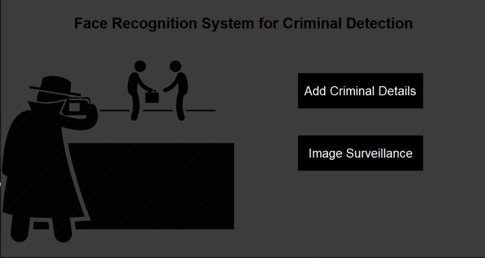
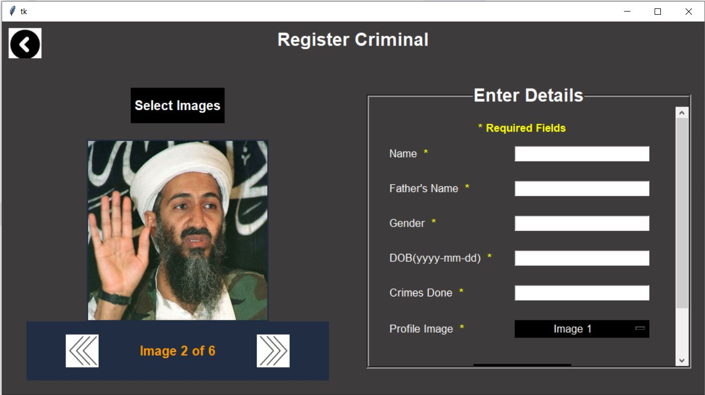
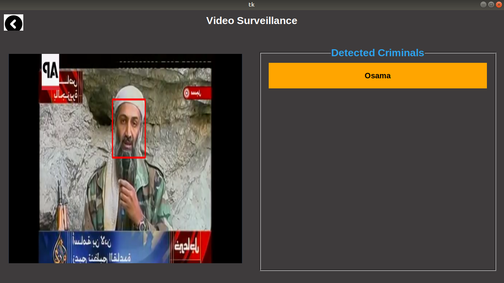

# Criminal_Identification_Using_ML_and_Face_Recognition_Techniques

---

Criminal Identification Using ML & Face Recognition : Real-time criminal identification using ML and face recognition. Detects faces via Viola-Jones, matches against a criminal database, and supports live surveillance, tracking, and alerts to help authorities monitor high-risk areas efficiently.

---

## 📸 Project Screenshots

